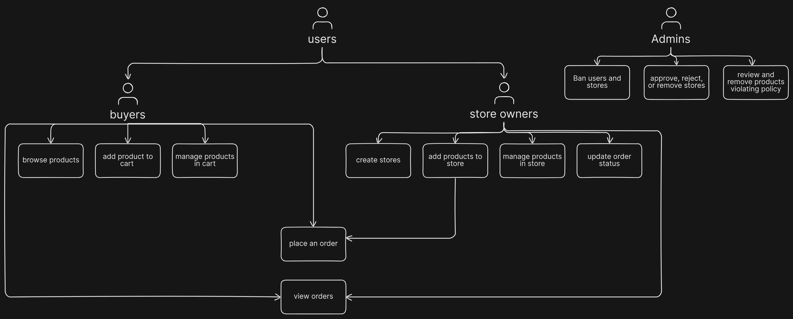
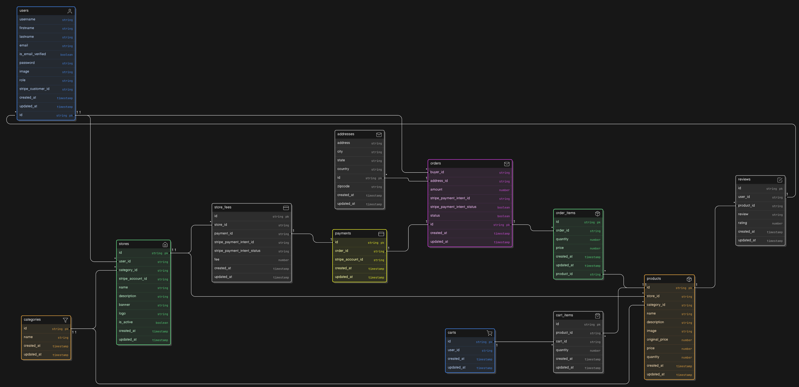

# MarketSpace

A decentralized E-commerce backend API where users can create their own stores, list products, and purchase items from other stores, while also allowing admin management and moderation.

[](https://app.eraser.io/workspace/d93EiOmFJbvJZyf45RLj?origin=share)

## Tech Stack

- **Backend:** [Node.js](https://nodejs.org/)
- **Framework:** [Express.js](https://expressjs.com/)
- **Database:** [Postgres](https://www.postgresql.org/)
- **Secondary Database:** [redis](https://redis.io/)
- **ORM:** [Drizzle](https://orm.drizzle.team/)
- **Validation:** [Joi](https://joi.dev/)
- **Authentication:** [jsonwebtoken](https://jwt.io/)
- **OAuth:** [Passport.js](https://www.passportjs.org/)
- **Sending Emails:** [nodemailer](https://www.nodemailer.com/)
- **Email generation:** [mailgen](https://www.npmjs.com/package/mailgen)
- **Payment Infrastructure:** [stripe](https://docs.stripe.com/)
- **File uploads:** [Multer](https://www.npmjs.com/package/multer)
- **E2E testing:** [Playwright](https://playwright.dev/)
- **API Testing:** [Supertest](https://www.npmjs.com/package/supertest)
- **Unit Testing:** [jest](https://jestjs.io/)
- **Logging:** [Winston](https://www.npmjs.com/package/winston) and [Morgan](https://github.com/expressjs/morgan)

## Features to be implemented

- [x] implement user authentication
- [] implement user information update
- [] implement store creation and management
- [] implement product creation and management
- [] implement product and store search and filtering
- [] implement cart management
- [] implement order placement and management for buyers
- [] implement payment integration with stripe
- [] implement order management for store owners
- [] implement order history for buyers
- [] implement store fees
- [] implement product review
- [] implement admin functionalities
- [] setup swagger API for documentation

## Database Structure

[](https://app.eraser.io/workspace/9oPlJPeyIX8b0l4G0mPk?origin=share)

## Running Locally

1. clone repository

```bash
  git clone git@github.com:Raphico/market-space.git
  cd market-space
```

2. install dependencies

```bash
  npm install
```

3. copy `.env.sample` to `.env` and update the variables

```bash
  cp .env.sample .env
```

4. start the development server

```bash
  npm run dev
```

5. push database schema

```bash
  npx drizzle-kit push
```

## License

Licensed under the MIT License. Check the [LICENSE](./LICENSE) file for details.
